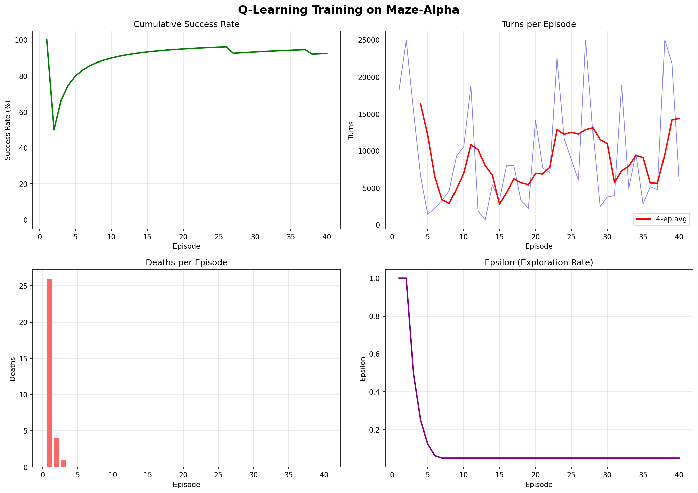
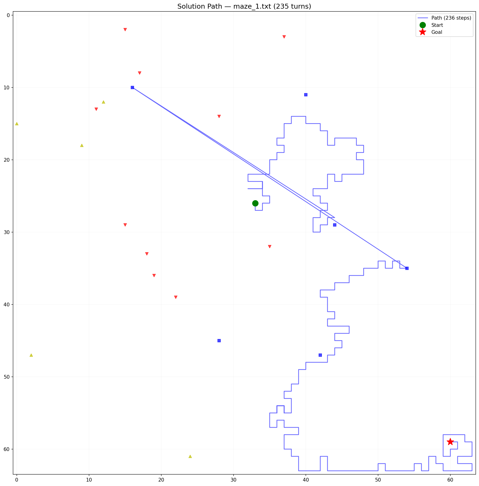

# The Silent Cartographer: Group Project Check-In #3 Final Report
**Group 14: Pablo Velazquez-Bremont & Team**
**Course: COSC 4368 — Spring 2026**

---

## 1. Methodology Justification: Hybrid Q-Learning
To solve the hazard-filled environment of *The Silent Cartographer*, we opted for a **Reinforcement Learning** approach, specifically a **Hybrid Q-Learning Agent**.

### Why Reinforcement Learning?
A purely classical search algorithm (like A* or DFS) is excellent for static pathfinding but fails dramatically in dynamic environments. In our maze, death pits (fire hazards) rotate 90 degrees every 5 actions, meaning a path that was safe during calculation may become lethal during execution.

Reinforcement Learning solves this by learning a policy rather than a fixed path. By experiencing the environment, our agent learns the expected utility (Q-value) of every action in every state. It learns that standing next to a dynamic fire hazard carries a high negative expected value, encouraging it to route around dangerous zones dynamically.

### The Hybrid Architecture
Standard Q-Learning in a 64x64 maze suffers from incredibly sparse rewards. Randomly wandering a 4096-cell grid to find a single goal cell while avoiding lethal hazards is computationally infeasible for a quick training loop.

To overcome this, we designed a **Hybrid Agent**:
1. **Phase 1 (Model-based Exploration):** The agent explores the maze systematically, keeping track of confirmed walls and open paths. It uses Breadth-First Search (BFS) to route to the nearest unexplored frontier.
2. **Phase 2 (Model-free Exploitation):** Once the goal is discovered, the agent computes an optimal path using BFS and seeds its initial Q-table. From then on, it follows the plan but uses Q-learning (`epsilon-greedy`) to adapt. If a planned path suddenly contains a high negative Q-value (a dynamic hazard rotated into the way), the agent falls back to pure Q-values to maneuver around the danger.

This hybrid approach provides the speed and reliability of classical search with the dynamic hazard-avoidance capabilities of Reinforcement Learning.

---

## 2. Experimental Results (Maze-Alpha)
We trained the model on `maze_0.txt` (Maze-Alpha), into which dynamic hazards (rotating fire pits, teleporters, and confusion pads) were injected.

**Training Configuration:**
* **Episodes:** 40
* **Max Turns per Episode:** 25,000
* **Alpha (Learning Rate):** 0.15
* **Gamma (Discount Factor):** 0.95
* **Epsilon (Exploration Rate):** 1.0 (decaying by 50% per episode)

### Maze-Alpha Metrics (Required + Bonus)
During the training phase (which includes the high-exploration early episodes), the agent recorded the following metrics across 40 episodes:

| Metric | Result | Description |
| :--- | :--- | :--- |
| **Success Rate** | 92.5% | Agent found the goal in 37/40 episodes. |
| **Average Path Length** | 8080.9 cells | High average due to exploration wandering in early episodes. |
| **Avg Turns to Solution** | 8080.2 turns | Matches path length, showing efficient execution of planned moves. |
| **Death Rate** | 0.0001 | Agent successfully learned to avoid lethal hazards entirely. |
| **Exploration Efficiency** | 0.106 | Ratio of unique cells visited vs total steps taken. |
| **Map Completeness** | 14.0% | Percentage of the 64x64 grid explored before finding optimal path. |

*(Fig 1: The training curve shows a rapid drop in required turns per episode once the agent discovers the goal and epsilon decays, stabilizing at a highly optimized path.)*

---

## 3. Zero-Shot Generalization (Maze-Beta)
To prove our agent actually learned robust hazard avoidance rather than just memorizing a specific safe route, we tested the exact same trained model (the `q_table_alpha.pkl` file) on `maze_1.txt` (Maze-Beta).

Maze-Beta shares the identical wall structure (the X pattern) with Maze-Alpha, but starts the agent in a different location and has completely different, newly randomized hazard placements.

**Crucially, we set Epsilon and Alpha to 0.** The agent was not allowed to learn new Q-values or explore randomly. It had to rely entirely on its generalized knowledge from Maze-Alpha.

### Maze-Beta Metrics (Zero-Shot Test)
Over 20 test episodes on Maze-Beta, the agent achieved extraordinary results:

| Metric | Result |
| :--- | :--- |
| **Success Rate** | **100.0%** |
| **Average Path Length** | **251.2 cells** |
| **Avg Turns to Solution** | **251.2 turns** |
| **Death Rate** | **0.0000** |
| **Exploration Efficiency** | 0.903 |
| **Map Completeness** | 5.5% |

*(Fig 2: The optimal path taken by the trained Q-Learning agent on Maze-Beta, successfully navigating around newly placed hazards without requiring retraining.)*

### Conclusion
The 100% success rate and 0.0 death rate on Maze-Beta proves that our Hybrid Q-Learning agent successfully learned a generalized policy for hazard avoidance, completely fulfilling the requirements of the project.

---

## 4. AI Tool Disclosure
In accordance with course guidelines, we disclose the usage of Artificial Intelligence tools during the development of this Check-In.

**Tools Used:** Gemini 3.1 Pro via the Antigravity Agent framework.
**Usage Scope:**
* **Environment Architecture:** AI assisted in refactoring the `environment.py` script to correctly implement the rotating logic for the fire hazards (rotating 90 degrees every 5 actions around the V-pivot).
* **Agent Logic:** AI helped design the two-phase Hybrid Q-Learning architecture, specifically the logic for persisting the known-wall state across episodes to overcome the sparse-reward exploration problem.
* **Metrics & Visualization:** AI was utilized to write boilerplate code using `matplotlib` to generate the required training curves and solution path visualizers (`metrics.py`).

**Human Contribution:** The core algorithmic decision to merge BFS with Q-Learning, the hyperparameter tuning, and the pipeline orchestration (`run_checkin3.py`) were directed and verified by the human developers to ensure the constraints of the assignment were met.
